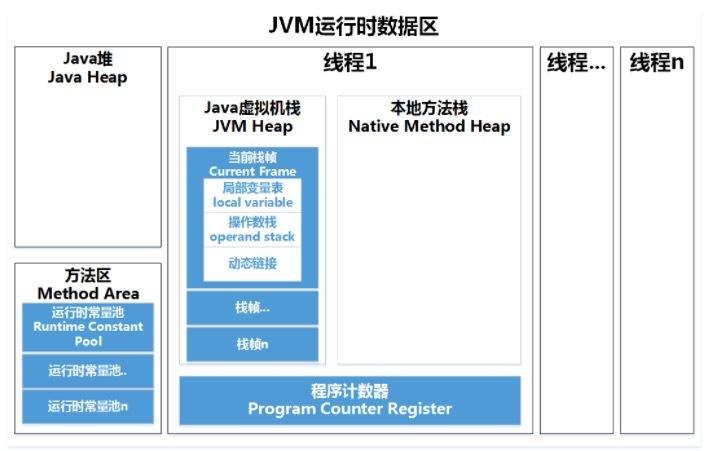
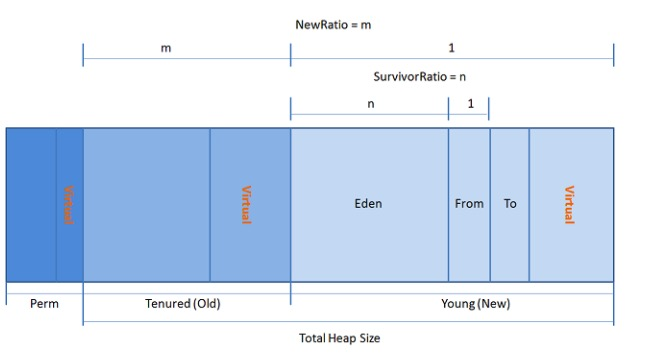

# Java虚拟机/垃圾回收

## JVM

### Java内存区域？

### 程序计数器 Program Counter Register ？

- 看做当前线程执行的字节码的**行号指示器**
- **字节码解释器**通过改变计数器的值来选取下一条需要执行的字节码指令
- 线程私有，确保多线程时进行线程切换能够恢复到正确的执行位置
- 如果正在执行的是一个Java方法，记录正在执行的虚拟机字节码指令地址
- 如果执行的是Native方法，则计数器为空

### Java虚拟机栈 Java Virtual Machine Stacks？

- Java方法执行的内存模型
- 每个方法执行时创建一个**栈帧** Stack Frame。栈帧存储 **局部变量**、**操作数栈**、**动态链接**、**方法出口**
- 一个方法从调用到执行完成对应一个栈帧从入栈到出栈的过程
- 局部变量表存放编译器可知的各种数据类型、对象引用

### 本地方法栈 Native Method Stack？

- 作用类似于Java虚拟机栈。区别是为虚拟机使用到的Native方法服务

### Java堆 Heap？

- Java虚拟机管理的内存中最大的一块
- **线程共享**的内存区域，在虚拟机启动时创建
- 作用是**存放对象实例**，几乎所有对象实例和数组都在这分配内存
- 垃圾收集器管理的主要区域，也被称作**GC堆**

- 分为**新生代**、**老生代**。新生代分为Eden空间、From Survivor空间、To Survivor空间。默认比例8：1：1。

### 方法区 Method Area？

- **线程共享**的内存区域
- 存储已被虚拟机加载的**类信息**、**常量**、**静态变量**、**即时编译器JIT编译过的代码**
- Non-Heap

### 运行时常量池？

- 方法区的一部分
- 存放Class文件中 编译期生成的各种字面量和符号引用
- 在类加载后存放到方法区的运行时常量池中

### 元空间 Metaspace？

### JVM调优

如果CPU使用率较高，GC频繁且GC时间长，可能就需要JVM调优了。
 基本思路就是让每一次GC都回收尽可能多的对象，
 对于CMS来说，要合理设置年轻代和年老代的大小。该如何确定它们的大小呢？这是一个迭代的过程，可以先采用JVM的默认值，然后通过压测分析GC日志。

如果看年轻代的内存使用率处在高位，导致频繁的Minor GC，而频繁GC的效率又不高，说明对象没那么快能被回收，这时年轻代可以适当调大一点。

如果看年老代的内存使用率处在高位，导致频繁的Full GC，这样分两种情况：如果每次Full GC后年老代的内存占用率没有下来，可以怀疑是内存泄漏；如果Full GC后年老代的内存占用率下来了，说明不是内存泄漏，要考虑调大年老代。

对于G1收集器来说，可以适当调大Java堆，因为G1收集器采用了局部区域收集策略，单次垃圾收集的时间可控，可以管理较大的Java堆。

### 类文件结构？

1. 魔数。4个字节
2. Class文件版本
3. 

### 类加载过程？

Class文件需要加载到Java虚拟机中才能运行和使用。Class文件加载过程分为三步：**加载** --> **连接**（*验证*、*准备*、*解析*） --> **初始化**

类的完整生命周期：

- **加载**

  - 通过类的全限定名获取定义这个类的二进制字节流
  - 把字节流代表的静态存储结构转换为方法区的运行时数据结构
  - 内存中生成一个代表这个类的 `java.lang.Class` 对象，作为方法区这个类的各种数据的访问入口

  二进制字节流的来源有ZIP压缩包读取、Web Applet获取、动态代理技术在运行时生成、其他文件生成比如JSP。

  非数组类的加载阶段时可控性最强。既可以使用虚拟机中内置的引导类加载器完成，也可以用户自定义自己的类加载器控制字节流的获取方式，比如重写一个类加载器的 `finClass()` 方法或者 `loadClass()` 方法

- **连接**

  - **验证**

    Class字节流并不是只能从Java文件编译而来，因此一些可以在编译阶段发现的错误代码比如数组访问越界可能在二进制字节流中存在。这一步要保证字节流包含的信息符合《Java虚拟机规范》的全部约束要求，防止代码损害Java虚拟机自身安全。

    - **文件格式验证**。要求格式符合描述Java类型信息的要求，通过验证后字节流才允许进入JVM内存的方法区存储。比如是否是魔数0xCAFEBABE开头、版本号是否在虚拟机处理范围内...
    - **元数据验证**。对字节码描述的类的元数据信息进行语义分析。比如这个类是否有父类、父类是否继承了`final`类、如果不是抽象类，是否实现了父类和接口中要求实现的方法、字段方法是否与父类有矛盾...
    - **字节码验证**。通过数据流分析和控制流，确定程序语义合法、符合逻辑。比如类型转换
    - **符号引用验证**。发生在连接的第三阶段：解析阶段中。对类自身以外的各类信息匹配性校验，也就是是否缺少或者被禁止访问它依赖的外部类、方法、字段。保证解析行为能正常执行。

  - **准备**

    正式为类中定义的变量（类变量，也就是`static`静态变量，不包括实例变量）分配内存，并设置类变量初始值。

    如果类变量定义为 `public static int value = 123;` ，准备阶段`value`仍然初始化为0，因为还没执行任何方法，赋值动作在类的初始化阶段执行。

    如果用`final`定义，会初始化为123。

  - **解析**

    将常量池中的符号引用替换为直接引用。针对类或接口、字段、类方法、接口方法、方法类型、方法句柄、调用限定词。得到类或字段、方法在内存中的指针或者偏移量。

- **初始化**

  类加载的最后一步。执行类构造器`<clinit>()`方法的过程。

  与类的构造函数（实例构造器`<init>()`）不同，不需要显式调用父类构造器，JVM会保证子类`<clinit>()`前，父类`<clinit>()`已被执行完毕。也就是说父类的`static`语句块一定在子类的变量赋值前进行。

  如果一个类中没有`static`语句块，也没有变量的赋值操作，编译器可以不为其生成`<clinit>()`方法。

  JVM必须保证一个类的`<clinit>()`方法在多线程环境被正确地加锁同步。多个线程同时初始化一个类时，只有一个线程去执行`<clinit>()`方法，其他线程阻塞等待，直到活动线程`<clinit>()`完成。当`<clinit>()`中耗时很长，就可能导致多个进程阻塞。

- **使用**

- **卸载**

  卸载类表示该类的Class对象被GC。需要满足三个要求：

  堆中不存在该类的实例对象；该类没有在任何地方被引用；该类的类加载器已经被GC。

  因此JVM自带的类加载器加载的类不会被卸载，自定义的类加载器加载的类可能被卸载。

### 类加载器？

JVM中内置了三个类加载器`ClassLoader`。除了`BootstrapClassLoader`，其他类加载器都用Java实现并继承于 `java.lang.ClassLoader`

任何类都要通过加载它的**类加载器**和这个**类本身**共同确定**类在JVM中的唯一性**。每一个类加载器都有一个独立的类名称空间。也就是说即使两个类来自同一个Class文件，只要它们通过不同的类加载器加载，这两个类就不相等。

- **启动类（引导类）加载器** `BootstrapClassLoader`：这是最顶层的类加载器，用C++实现，负责加载 `%JAVA_HOME%/lib` 目录下的jar包和类，以及 `-Xbootclasspath` 参数指定路径中的类
- **扩展类加载器**：**（在JDK8中为`ExtensionClassLoader`，JDK9中为`PlatformClassLoader`）**负责加载 `%JAVA_HOME%/lib/ext` 目录下的jar包和类，以及被 `java.ext.dirs` 系统变量指定的路径下的jar包
- **应用程序类加载器** `AppClassLoader`：面向用户的类加载器，负责加载当前应用classpath下的所有jar包和类

### 双亲委派模型？

- 当一个类加载器收到一个加载类的请求，，先将这个请求委托给父类加载器，并依次溯源，最终请求被传送到顶层的启动类加载器中，只有父类加载器无法加载时，才会尝试自己完成加载。
- 保证Java程序稳定运行，避免类的重复加载，因为不同类加载器加载的类在JVM中视为两个类。
- 保证Java核心类不被篡改，阻止恶意代码。

### 自定义类加载器？

## 垃圾回收

### GC算法？

- **引用计数法**
  - 在对象中添加一个引用计数器
  - 对于对象A，任何对象引用了A，它的引用计数器+1，引用失效-1
  - 引用计数器变成0的时候，不能再使用
  - Java虚拟机都不使用。无法解决对象循环引用
- **可达性分析算法**
  - 一系列***GC Roots***作为起始节点集
  - 根据引用关系向下搜索，搜索路径称为**引用链**
  - 某个对象到***GC Roots***没有任何引用链，对象不可再使用
  - ***GC Roots***包括：
    - 虚拟机栈中引用的对象，各个线程被调用的**方法堆栈中使用的参数**、**局部变量**、**临时变量**
    - 方法区中**类静态属性引用的对象**，比如Java类的**引用类型静态变量**
    - 方法区**常量引用的对象**，比如字符串常量池里的引用
    - 本地方法栈中**JNI**（Native方法）引用的对象
    - **Java虚拟机内部的引用**，比如**基本数据类型对应的Class对象**，**常驻的异常对象**（NullPointExeception、OutOfMemoryError）等，还有系统类加载器
    - 所有被***synchronized***持有的对象
    - 反应JVM内部情况的JMXBean、JVMTI中注册的回调、本地代码缓存等
- **标记-清除算法（Mark-Sweep）**
  - 标记阶段通过根节点标记可达对象
  - 未被标记则是垃圾对象
  - 容易造成内存碎片化（分配大对象时无法找到足够的连续内存）
  - 执行效率不稳定（执行效率与对象数量有关）
- **标记-复制算法**
  - 内存分为两块，一半放数据，另一半不放
  - GC时将正在使用的内存的存活对象拷贝到未使用的内存块，清楚原来的所有对象
  - 有内存浪费
  - **现在的JVM大多优先采用这种算法回收新生代**
  - **Appel式回收**（新生代内存布局）：
    - 新生代分为较大的一块**Eden**空间，较小的两块**Survivor**（8:1:1）
    - 分配内存只使用Eden和其中一块**Survivor**
    - **GC**时将仍然存活的对象一次性复制到另一块**Survivor**上
    - 清理掉**Eden**和以用过的**Survivor**
    - **Survivor**无法容纳一次***Minor GC***之后存活的对象时，通过其他内存区域（大多是老年代）进行分配担保
  - 对象存活率较高时复制操作较多，效率降低（老年代无法使用）
- **标记-整理算法（Mark-Compact）**
  - 先标记对象
  - 让所有存活的对象都向内存空间一端移动
  - 清理掉边界以外的内存
  - 针对老年代，没有内存浪费
  - 操作负重高，必须全程暂停用户应用程序：***Stop the world***
  - HotSpot中Parallel Scavenge收集器（关注吞吐量）使用标记-整理；CMS（关注延迟）使用标记-清除

### 老生代和新生代？

- 新生代分为eden、survivor1、survivor2。new的对象非常大则放入老生代，否则放入edan，GC一次后仍有引用，放入survivor1，再经历一次放入survivor2.一定次数后放入老生代。