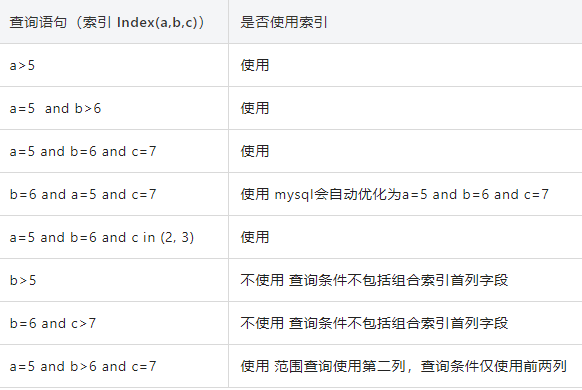
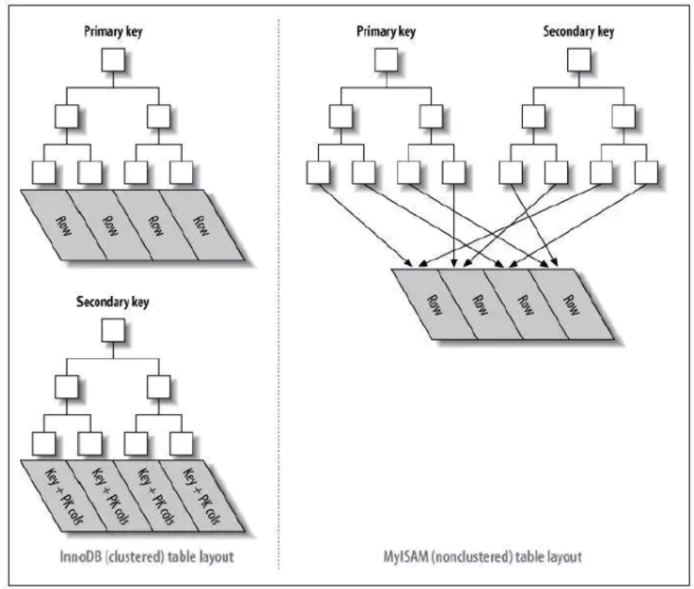
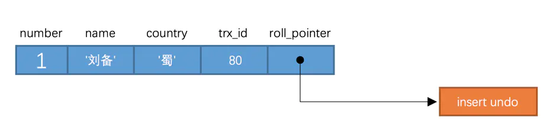
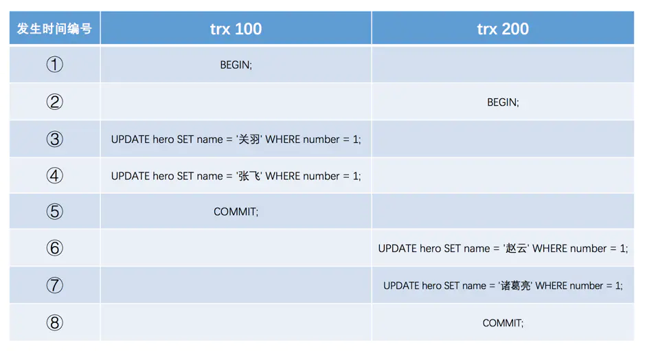
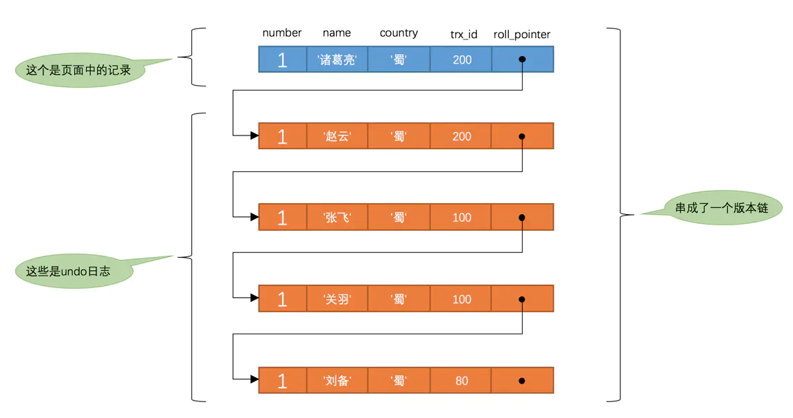

# 数据库

## 数据库基础

### 事务特性？

ACID

- Atomicity**原子性**：数据库事务是不可分割的工作单位，只有事务中的所有的数据库操作都执行成功，才算整个事务成功。事务中任何一个SQL执行失败，已经执行成功的SQL语句也必须撤销，回到执行事务的之前的状态。
- Consistency**一致性**：事务将数据库由一种一致性状态转为下一种一致性状态。事务开始前后，数据库完整性约束没被破坏。例：转账前后，账户余额的总和保持一致。
- Isolation**隔离性**：每个读写事务对其他事务的操作对象能相互分离。
- Durability**持久性**：事务一旦提交，结果被永久改变，即使出现故障也保持。

### 事务并发问题？

- **脏写** *Dirty Write*：一个事务修改了其他事务未提交的数据
  - 事务A更新某条数据
  - 事务B随后更新这条数据
  - 事务B进行回滚
  - 事务A的更新丢失
- **脏读** *Dirty Read*：一个事务读到了其他事务未提交的数据
  - 事务B更新了某条数据
  - 事务A查询到这条数据
  - 事务B进行回滚
  - 事务A读到了不存在的数据
- **不可重复读** *Non-Reatable Read*：事务执行过程中读到其他事务提交的数据，两次读取结果不一致
  - Session B中提交几个隐式事务
  - 每次提交后Session A中的事务都可以查看到最新值
  - 多次读结果不一样
- **幻读** *Phantom*：事务执行过程中，读取到了其他事务新插入的数据
  - Session A事务根据某个条件查询数据
  - Session B提交了隐式事务，插入新记录
  - Session A事务再次根据这个条件查询
  - 出现了新数据，两次查询结果不同

### 事务隔离级别？

主要在多个事务并发的情况下。解决脏读、不可重复读、幻读等问题。

#### Read uncommitted 读未提交

- 脏读：事务B读取了事务A尚未提交的数据，即事务A还未结束就回滚的数据被事务B读到。

#### Read committed 读提交

- 不会出现脏读，但会出现不可重复读。
- 不可重复读：事务A读取数据后，事务B紧接更新了数据并提交事务，事务A再次读取的时候，数据已经被修改。
- SQL Server、Oracle默认级别

#### Repeatable read 重复读

- 避免不可重复读。一个事务中重复读取数据，不会发生变化，除非提交了数据，再次进行读取
- 幻读：事务A查询了数据，此时事务B新增一条数据。事务A继续新增这条数据时发现冲突，或者更新时影响的行数跟刚刚读取的不一致。

#### Serializable 串行化

- 最高的事务隔离级别。
- 事务顺序执行，避免脏读、不可重复读、幻读。
- 性能很低，很少使用。

## MySQL

### 索引

| 索引              | InnoDB        | MyISAM引擎 | Memory引擎 |
| :---------------- | ------------- | ---------- | ---------- |
| B-Tree索引        | 支持          | 支持       | 支持       |
| Hash索引          |               |            | 支持       |
| R-Tree索引        |               | 支持       |            |
| 全文索引Full-text | 5.6版本后支持 | 支持       |            |

### B-Tree结构？

- 又叫多路平衡搜索树，$m$叉的B-Tree性质：
  - 每个节点最多有$m$个子节点
  - 除了根节点和叶节点，每个节点至少有$[ceil(m/2)]$个子节点
  - 如果根节点不是叶节点，至少有两个子节点
  - 所有叶节点都在同一层
  - 每个非叶节点由$n$个key和$n+1$个指针组成。$[ceil(m/2) - 1] <= n <= m - 1$

### B+Tree结构？

区别：

- n叉B+Tree最多有n个key，BTree最多有n-1个key
- B+Tree叶节点保存所有key信息，按key顺序大小排列
- 所有非叶节点都可以看做key的索引部分

只有叶节点保存key信息，查询任何key都要从根节点走到叶节点，因此查询效率稳定。

MySQL中对B+Tree进行了优化，在叶节点中增加了指向相邻叶节点的链表指针，提高区间访问的性能。

### 索引分类？

- 单值索引：一个索引只包含单个列，一个表中可以有多个单值索引
- 唯一索引：索引的值必须唯一，允许有空值
- 复合索引：一个索引包含多个列

### 索引设计原则？

- 频繁作为查询条件的字段应该建立索引（`where` 子句内的字段）
- 唯一性太差也就是重复性太高的字段不适合建立索引（比如性别）
- 字段更新比查询频繁很多的字段不适合
- 不会出现在 `where` 子句内的字段不应该建立索引
- 使用短索引，对于较长的字符串列可以指定前缀长度，节省空间，提高速度
- 最左前缀原则

### 最左前缀原则？

MySQL的索引可以引用多列，叫做联合索引。当一个查询条件可以匹配联合索引的前面一列或者多列，就可以命中索引。

```mysql
ALTER TABLE user ADD INDEX name_city_index (name, city) // 建立了联合索引
select * from user where name=xx and city=xx ; // 可以命中索引
select * from user where name=xx ; // 可以命中索引
select * from user where city=xx ; // 无法命中索引  
```

因此在建立联合索引时，要考虑将常用查询语句中重复较多的字段放在前面。



### 覆盖索引？

如果一个索引包含（或者说覆盖）所有需要查询的字段的值，我们就称之为“覆盖索引”。我们知道InnoDB存储引擎中，如果不是主键索引，叶子节点存储的是主键+列值。最终还是要“回表”，也就是要通过主键再查找一次。这样就会比较慢覆盖索引就是把要查询出的列和索引是对应的，不做回表操作！

- 建立联合索引，查询索引中包含的列值
- 使用count()聚合函数使用有索引的列

### 聚簇索引？



- 聚簇索引
  - 表数据与主键一起存储，主键索引的叶节点存储行数据。
  - 二级索引的叶节点存储主键值
  - 使用B+树
  - InnoDB表聚簇索引逻辑：
    - 如果有主键，使用主键作为聚簇索引
    - 如果没有主键，在所有不为null的列中找到唯一索引作为聚簇索引
    - 如果没有主键和合适的唯一索引，在包含行ID值的合成列上内部生成一个GEN_CLUST_INDEX的隐藏聚集索引
- 非聚簇索引
  - 表数据与索引分为两部分，主键索引和二级索引没有区别

### 数据库优化？

[「数据库调优」屡试不爽的面试连环combo](https://zhuanlan.zhihu.com/p/147490337)

### **MVCC** *Multi Version Concurrency Control*

#### 版本链

- InnoDB中每行记录都包含两个隐藏字段
  - **事务id** `trx_id`：修改某行记录时，将事务id赋值给`trx_id`
  - **回滚指针** `roll_pointer`：修改某行记录时，将undo log地址赋值给`roll_pointer`



事务id100、事务id200进行update操作：



使用undo log记录数据变化，roll_pointer指向undo log地址，形成版本链：



#### ReadView

- **读未提交**：直接读取版本链最新版本数据（头节点数据）
- **串行化**：事务之间加锁执行
- **读已提交**、**可重复读**：遍历版本链中每条记录，判断该记录是否对当前事务可见，直到找到为止，找不到说明不存在。


**InnoDB**使用**ReadView**实现：

- `m_ids`：在生成ReadView时，当前系统中活跃的读写事务的id列表
- `min_trx_id`：在生成ReadView时，当前系统中活跃的读写事务中最小的事务id（`m_ids`中的最小值）
- `max_trx_id`：生成ReadView时系统中应该分配给下一个事务的id
- `creator_trx_id`：生成该ReadView事务的事务id


根据ReadView，通过以下步骤判断某个版本的记录是否对当前事务可见：

- `ator_trx_id`相同，表示当前事务在访问它自己修改的记录，所以可以被当前事务访问
- 如果被访问版本的`trx_id`小于ReadView的`min_trx_id`，表示生成该版本的事务在当前事务生成ReadView前已经提交，所以可以被当前事务访问

- 如果被访问版本的`trx_id`大于等于ReadView里的`max_trx_id`，表示生成该版本的事务在当前事务生成ReadView之后才开启，所以不能被当前事务访问
- 如果`tax_id`在`min_trx_id`和`max_trx_id`之间，要判断`trx_id`是不是在`m_ids`列表中，如果在，说明创建ReadView时生成该版本的事务仍然活跃，该版本不能被访问。如果不在，说明创建ReadView时该版本的事务已经被提交，该版本可以被访问


- **读已提交**在每次读取前都会生成一个ReadView，保证每次都能读到其他事务已提交的数据
- **可重复读**只在第一次读取数据时生成一个ReadView，来保证后续读取结果完全一致

### 锁

#### 事务并发情况

- **读-读**：并发事务同时访问同一行数据记录。并发读完全允许
- **写-写**：并发事务同时修改同一行数据记录。可能导致脏写问题。当一个事务需要修改某一行记录，首先给这条记录加锁，加锁成功继续执行，否则排队等待。事务结束自动释放锁
- **读-写**：一个事务读取，另一个写入。可能会出现脏读、不可重复读、幻读。读操作使用MVCC，写操作加锁。

#### 锁的粒度

- **行级锁**：作用在数据行上，锁的粒度小
- **表级锁**：作用在整张表上，锁的粒度大

#### 锁的分类

- **共享锁** *Shared Locks*：简称**S锁**。事务要读取一条记录时，先获取该记录的**S锁**。**S锁**可以同时被多个事务拥有。

  手动加S锁：`select ... lock in share mode;`

- **排他锁** *Exclusive Locks*：简称**X锁**。事务要改动一条记录时，先要获取该记录的**X锁**。**X锁**同时最多只能有一个事务持有。

  **X锁**的加锁方式：

  - 自动加锁：在对数据进行增删改时，默认加上**X锁**
  - 手动加锁：用`FOR UPDATE`给数据加上**X锁**

- **意向锁** *Intention Locks*：数据库自动维护。给一行数据加上**共享锁**前，自动在表上加上**意向共享锁（IS锁）**；加上**排他锁**前自动在表上加上**意向排他锁**。

  通过意向锁可以快速判断表中是否有记录被上锁，从而无需通过遍历判断，提高加锁效率。

- 事务已经持有某条记录的**S锁**，另一个事务无法获取该记录的**X锁**，反过来也一样

#### 表级锁

没有索引的表更新时锁定全表

表级锁包括意向共享锁（IS）、意向排他锁（IX）、自增锁（AUTO-INC）

自增锁用于AUTO_INCREMENT自增属性：

- AUTO_INC锁：执行插入语句时先加表级别的AUTO_INC锁，插入执行完立即释放锁。插入语句执行前无法确定插入数据数量时采用AUTO_INC锁方式
- 轻量级锁：插入语句生成AUTO_INCREMENT值时获取轻量级锁，生成后释放轻量级锁。如果插入语句执行前可以确定插入数量，使用轻量级锁方式对有AUTO_INCREMENT修饰的列赋值。避免锁定表，提高插入性能。MySQL默认自动选择加锁方式，也可以用 `innodb_autoinc_lock_mode` 强制指定只使用其中一种。

#### 行级锁

- **快照读**：事务利用MVCC进行的读取操作
  - RC Read committed 读取最新的快照
  - RR Repeatable Read 读取事务开始时的快照
- **锁定读**：读取的时候给记录加锁
  - RN Read uncommitted 读当前
  - 语句加上写锁或读锁

通过锁住索引来实现，如果加锁查询时没有使用索引，会锁住整个聚簇索引，相当于锁表。

- **记录锁** *Record Locks*
  - 直接锁定某行记录
  - 用唯一索引或聚簇索引等值查询匹配到一条记录时，直接suod
  - `select * from t where id = 4 for update`

- **间隙锁** *Gap Locks*
  - 锁定间隙区间
  - 使用等值查询或者范围查询且没有命中记录，会将对应的间隙区间锁定
  - `select * from t where id = 3 for update`
  - `select * from t where id > 1 and id < 4` 锁定(1, 4)区间
  - 防止幻读
  - 范围过大会锁定整个范围，影响性能
  - 读已提交时间隙锁和临键锁失效
- **临键锁** *Next-Key Locks*
  - 间隙加上右边记录的左开右闭区间。比如(1, 4]
  - 记录锁、间隙锁的结合
  - MySQL默认行锁类型