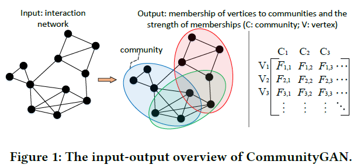
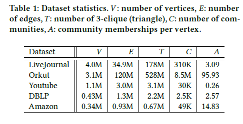
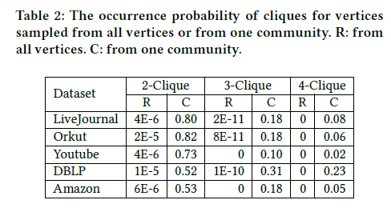
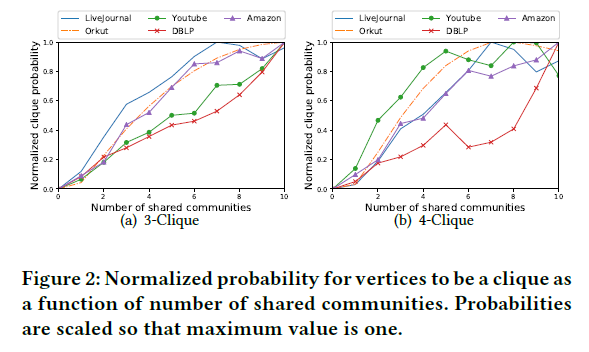
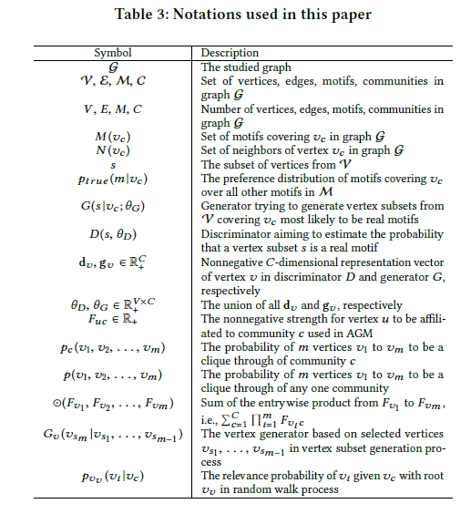
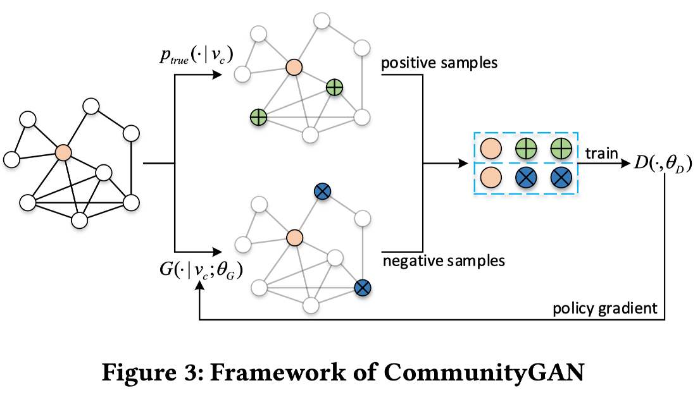
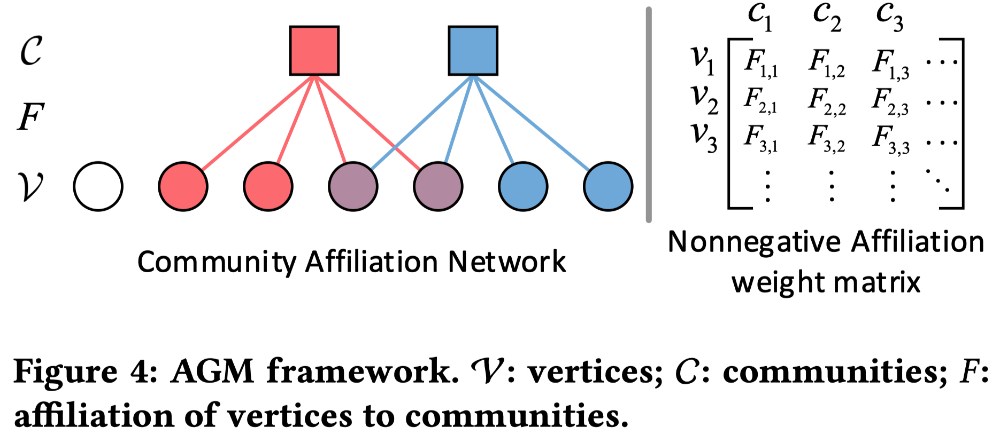
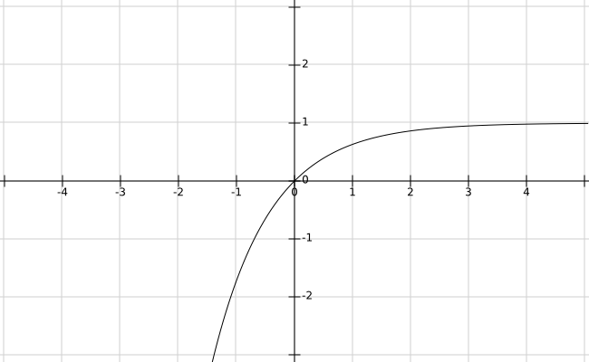

# CommunityGAN: Community Detection with Generative Adversarial Nets

生成对抗网络的社区检测算法

# Pre
GAN(Generative Adversarial Network)

**AGM(Affiliation Graph Model)**：对密集重叠的社区结构进行建模的框架。对顶点-社区对分配一个非负因数，表示顶点对社区的隶属程度。一个顶点到所有社区的隶属关系构成表示向量

# Abstract
- 图的表示学习被用于社区检测，但只能用节点嵌入的聚类算法检测社区
- 聚类算法无法检测重叠社区
- **CommunityGAN**：解决重叠社区检测和图的表示学习
- 区别于传统的图嵌入，CommunityGAN的嵌入表示节点对社区的隶属强度
- 使用GAN优化嵌入

# Keywords
- 社区检测
- 图表示学习
- 生成式对抗网络

# Introduction
- **社区发现Community Detection**：节点分组，属性相似或功能相同
- **图嵌入Graph Embedding**：将图的每个节点表示为低维向量
- 深度学习算法Skip-gram, Convolutional Network进展很大
- 引入GAN(Generative Adversarial Nets)
- 成果有利于链接预测、推荐和节点分类
- 重叠密集的社团嵌入存在很多限制
- 一般来说，向量的相互距离比较有用，而单个向量没有意义
- 检测社区的直接方法是在向量空间使用聚类算法
- 一个顶点可能属于多个社区，聚类算法无法处理

## Community GAN

- 用于解决重叠的社区检测和图表示学习
- **输入**：关系网络
- **输出**：顶点对社区的从属关系以及关系强度

- **AGM(Affiliation Graph Model)隶属图模型**：一个可以对密集重叠的社区结构进行建模的框架。它为每个顶点-社区对分配一个非负因数，该非负因数表示该顶点对社区的隶属程度。
因此，从一个顶点到所有社区的隶属关系的强度构成了它的表示向量。

## 生成和鉴别社区检测的图案

- 生成器：生成顶点子集`s`，组成特定图案
- 鉴别器：鉴别子集`s`是否是真的图案
- 最终目标：生成器生成的图案无法被鉴别

## 论文贡献

- 组合AGM和GAN来实现优秀性能的GAN和顶点-社团的AGM表示
- 研究正确标记数据中的图案分布并分析它如何帮助提升社区检测的质量
- 提出一种图案生成的实现Graph AGM，使用计算方法生成最可能的图案

## 实验结果

- 解决密集重叠问题
- motif级的生成器和鉴别器
- 使用五个数据集，在社区检测和群体预测上评估CommunityGAN
- 社区检测和图形表示上，CommunityGAN优于最新方法
- F1-Score上得分比基线高7.9%到21%
- 3-派系和4-派系预测任务上，AUC分数分别提高到0.99和0.956
- 特有的嵌入方法、对抗学习、motif级别的优化

# Related Work
**Community Detection**
- 设计社团度量指标如模块度并进行优化
- 采用生成模型来描述图的生成，并且可以通过将图拟合到此类模型来推断社区
- 在图邻接矩阵上采用矩阵分解算法来输出顶点和社团之间的关系

**Graph representation learning**

- DeepWalk显示图形中的随机游动类似于自然语言中的文本序列，采用Skip-gram(词表示学习模型)来学习顶点表示
- Node2vec通过提出一种有偏的随机游走算法进一步扩展了DeepWalk的概念，该算法在生成采样的顶点序列时提供了更大的灵活性
- LINE首先学习保留一阶和二阶接近度的顶点表示
- GraRep应用在图上定义的不同损失函数来捕获图的不同k阶接近度和全局结构特性
- GraphGAN提出了一个统一的对抗学习框架，该框架自然地从图上捕获结构信息以学习图表示
- ANE利用GAN作为正则化器来学习稳定而强大的特征提取器

**Unified framework for graph representation learning andcommunity detection**

- Wang设计了模块化的非负矩阵分解算法，以保留顶点相似性和社区结构。但是，由于矩阵分解的复杂性，该模型无法应用于许多包含数百万个顶点的真实世界图 
- Cavallari设计了一个框架，解决社区嵌入，社区检测和节点嵌入

# Empirical Observation
数据集
- LiveJournal，Orkut和Youtube 在线社交网络
- DBLP 协作网络
- Amazon 产品网络

问题
- 社区如何组成motif
- 社区重叠的情况下图案生成有哪些变化

步骤
- 从社区中取2/3/4个点，判断是否能组成motif，获得一个社区中生成motif的概率

- 将这个概率与整个网络的概率相比较，本文主要关注的motif是2/3/4-派系

- motif的出现与社区结构关联性很大

- 两个顶点同属的社区越多，它们越可能是2-派系（有边相连）

- 本文发现3-派系、4-派系也存在这种情况，处于社区重叠中的顶点连接比单个社区中的更加紧密

# Methodology
## CommunityGAN框架
研究图：$\mathcal{G} = (\mathcal{V}, \mathcal{E}, \mathcal{M})$

节点集合：$\mathcal{V} = \{v_1,...,v_V\}$

节点间的边：$\mathcal{E} = \{e_{ij}\}_{i,j=1}^V$

$\mathcal{G}$中的真实motif集合：$\mathcal{M}$ （本论文只关注clique）

包含某节点的所有motif集合：$M(v_c)$ 大小一般远小于 $V$ 的顶点个数

$\mathcal M$ 中覆盖 $v_c$ 的所有motif的分布：$p_{true}(m\mid v_c)$

生成器Generator：$G(s|v_c;\theta_G)$ 尝试逼近 $p_{true}(m\mid v_c)$ ，并从 $\mathcal V$ 生成（或选择）覆盖 $v_c$ 的顶点的最有可能是真实motif的子集

鉴别器Discriminator：$D(s,\theta_D)$ 估计顶点子集 $s$ 是真实motif的概率，也就是是否来自于 $\mathcal M$ 

鉴别器和生成器中节点 $v$ 的非负 $C$ 维表示向量：$d_v$ $g_v$ 

$d_v$ $g_v$ 的union：$\theta _D$ $\theta _G$

$$\min\limits_{\theta_G}\max\limits_{\theta_D}V(G,D) = \sum_{c=1}^{V}(\mathbb E_{m\sim p_{true}(\cdot \mid v_c)}[logD(m;\theta_D)]+\mathbb E_{s\sim G(s\mid v_c;\theta_G)}[log(1-D(s;\theta_D))])$$

## CommunityGAN优化

给定真实motif分布 $p_{true}$ 中得到的正样本和 $G$ 中生成的负样本，鉴别器的目标是让正确判别样本的 $log$ 概率最大化，如果 $D$ 对于 $\theta _D$ 来说是可微分的，这点可以做到

鉴别器$D$ ：

$$\nabla _{\theta_D}V(G,D)=\sum_{c=1}^V(\mathbb E_{m\sim p_{true}(\cdot \mid v_c)}[\nabla _{\theta_D}logD(m;\theta_D)]+\mathbb E_{s\sim G(s\mid v_c;\theta_G)}[\nabla _{\theta_D}log(1-D(s;\theta_D))])$$

生成器的目的是让鉴别器正确判别样本的 $log$ 概率最小化，由于s的采样是离散的，计算 $V(G,D)$ 关于 $\theta _G$ 的梯度：

$$\nabla _{\theta_G}V(G,D)=\nabla _{\theta_G} \sum_{c=1}^V \mathbb E_{s\sim G(\cdot\mid v_c)}[log(1-D(s))]=\mathbb E_{s\sim G(\cdot\mid v_c)}[\nabla _{\theta_G} logG(s \mid v_c) log(1-D(s))]$$

## $D$和$G$的简单实现

分别基于Sigmoid函数和SoftMax函数

对鉴别器D，定义为输入顶点子集s中每两个顶点的内积sigmoid函数的乘积：$D(s)=\prod_{(u,v) \in s,u \neq v} \sigma(d_u^ \top \cdot d_u)$

$d_u$ $d_v$ 分别是u和v在鉴别器中的$k$维表示向量，$\theta _D$ 是所有 $d_v$ 的并集

$G$ 要生成覆盖 $v_c$ 的节点子集s，将子集看作一系列节点 $(v_{s_1},v_{s_2}, \cdots ,v_{s_m})$，其中$v_c=v_{s_1}$

生成器定义为：$G(s \mid v_c)=G_v(v_{s_2} \mid v_{s_1})G_v(v_{s_3} \mid v_{s_1},v_{s_2}) \cdots G_v(v_{s_m} \mid v_{s_1}, \cdots ,v_{s_{m-1}})$

$v_{s_m}$的生成基于从 $v_{s_{m-1}}$ 到 $v_{s_1}$ 的节点

直接将节点生成器定义为所有其他节点的 $softmax$ 函数：

$$G_v(v_{s_m} \mid v_{s_1}, \cdots ,v_{s_{m-1}})=\frac{\exp(\sum_{i=1}^{m-1}g_{v_{s_m}}^\top g_{v_{s_i}})}{\sum_{v \notin (v_{s_1},v_{s_2}, \cdots ,v_{s_{m-1}})}\exp(\sum_{i=1}^{m-1}g_v^\top g_{v_{s_i}})}$$

$g_v$ 是节点 $v$ 在生成器中的 $k$ 维表示向量，$\theta _G$ 是所有 $g_v$ 的并集

## Graph AGM

局限：

- 学习完节点的表示向量后，仍然要通过聚类算法检测社区，常规的聚类算法无法处理大量的重叠
- softmax的计算效率低下
- 生成器公式忽略了节点之间的距离

整体思想：

- 社区是由**共享的团体隶属关系** *shared group affiliation*产生的
- 网络是由**社区隶属度图模型** *Community-Affiliation Graph Model*生成的结果

- 可以看作节点和社区之间的二分网络，也可以看作一个非负的隶属度权重矩阵

- 节点 $u$ 对社区 $c$ 的非负隶属强度为 $F_{uc}$ 

- 对于社区 $c\in C$ ，连接其成员 $u,v$ 的概率是 $1-\exp(-F_{uc}\cdot F_{vc})$
- 如果 $u,v$ 通过不同社区多次连接，概率为 $1-\exp(-\sum _c F_{uc}\cdot F_{vc})$
- 节点 $u,v$ 通过任何社区相连的概率为 $p(u,v)=1-\exp (-F_u^\top \cdot F_v)$ 
-  $F_u$ 和 $F_v$ 分别是 $u,v$ 的非负C维隶属向量

将AGM从边生成扩展到motif生成

任意m个节点 $(v_1,...,v_m)$ ，他们通过社区 $c$ 形成一个clique的概率定义为：$p_c(v_1,v_2, \cdots ,v_m)=1-\exp (-\prod_{i=1}^m F_{v_ic})$

重新定义  $D(s)=1-\exp(-\bigodot(d_{v_1},d_{v_2}, \cdots ,d_{v_m}))$

$G_v$ 重新定义为所有其他可能节点上的 $softmax$ 函数：

$$G_v(v_{s_m} \mid v_{s_1}, \cdots ,v_{s_{m-1}})=\frac{1-\exp(-\bigodot(g_{v_{s_1}},g_{v_{s_2}}, \cdots ,g_{v_{s_m}}))}{\sum _{v\notin(v_{s_1}, \cdots ,v_{s_{m-1}})} 1-\exp(-\bigodot(g_{v_{s_1}},g_{v_{s_2}}, \cdots ,g_{v_{s_{m-1},g_v}}))}$$

学习到的 $g_v$ 表示节点v和各个社区之间的隶属权重，就不再需要其他聚类函数，也解决了重叠社区的问题

## softMax计算效率

假设一个虚拟节点 $v_v$ ，它的邻居节点是$(v_{s_1},...,v_{s_{m-1}})$ 中所有节点的邻居节点的union：$N(v_v)=N(v_{s_1})\cup \cdots \cup N(v_{s_{m-1}})$

虚拟节点的向量表征：$g_{v_v}=g_{v_{s_1}} \circ g_{v_{s_2}} \circ \cdots \circ g_{v_{s_{m-1}}}$

$G_v(v_{s_m} \mid v_{s_1}, \cdots ,v_{s_{m-1}})$ 变为 $G_v(v_{s_m} \mid v_v)$

根据给出的概率函数进行随机游走

# Other issues

## Model initialization

- 方法一：在图上使用AGM模型，学习关于每个点$v_i$的社区隶属向量$F_i$， $g_(v_i )=d_(v_i )=F_i$
- 方法二：使用局部最小邻域 *locally* *minimal neighborhoods*
  - $C(v_i)=v_i \cup N(v_i)$
  - 设$v_j$与$v_i$相邻，如果$C(v_i)$比所有的$C(v_j)$的**conductance**都小，$C(v_i)$称作局部最小
  - 节点$v_i$如果属于*locally minimal*，初始化$F_{v_i c}=1$，否则$F_{v_i c}=0$
- 方法一效果好，方法二省时间

