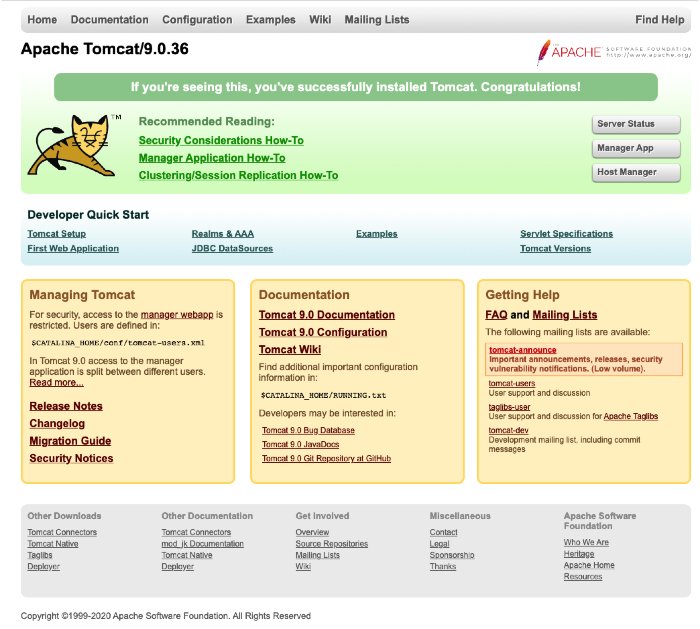

# Tomcat安装

## macOS下安装

1. [Apache Tomcat官网](http://tomcat.apache.org/)下载


2. 解压到`~/Library`下，可以将文件夹名称修改为`Tomcat`


3. `cd ~/Library/Tomcat/bin` 进入bin目录
4. `./startup.sh`启动Tomcat。如果出现`./startup.sh: Permission denied`，执行 `chmod u+x *.sh` 修改权限后再次启动
5. 浏览器访问`localhost:8080`



6. `./shutdown.sh`关闭Tomcat

7. 文件目录：
   
   > bin:存放tomcat命令
   > conf:存放tomcat配置信息,里面的server.xml文件是核心的配置文件
   > lib:支持tomcat软件运行的jar包和技术支持包(如servlet和jsp)
   > logs:运行时的日志信息
   > temp:临时目录
   > webapps:共享资源文件和web应用目录
   > work:tomcat的运行目录.jsp运行时产生的临时文件就存放在这里
   
8. `Tomcat/conf/server.xml`中修改端口号

```xml
<Connector port="8020" protocol="HTTP/1.1"
           connectionTimeout="20000"
           redirectPort="8443" />
```

9. Tomcat/conf/tomcat-users.xml`设置密码，重启后在Tomcat主页点击Manager App使用账号密码登录

```xml
<role rolename="manager-gui"/>
<user username="tomcat" password="tomcat" roles="manager-gui"/>
```